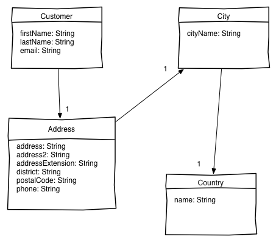
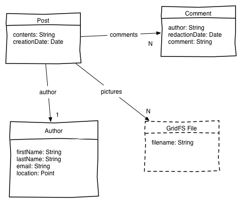
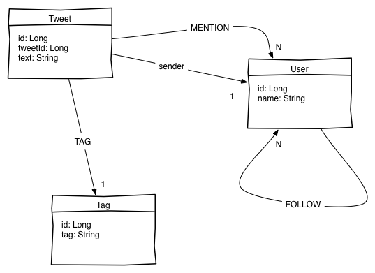

Note: Instructions in English are available [here](README.md)
#HANDS ON SPRING DATA

##Exercice 1 : JPA (Entre 5 et 30 mins)

Il s'agit de compléter la classe `JpaTest`. Cette classe utilise une base embarquée de type H2 (le setup vous est fournit) avec un jeu de données déjà pré-configuré.

Le modèle de données est très simple :

## Exercice 2 : Mongo

## Exercice 3 : Neo4j

